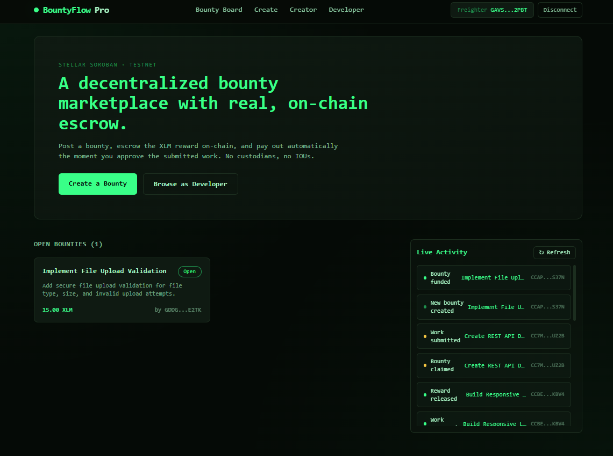
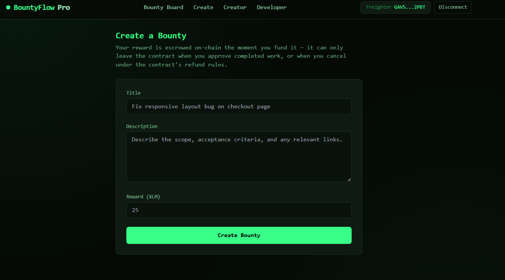
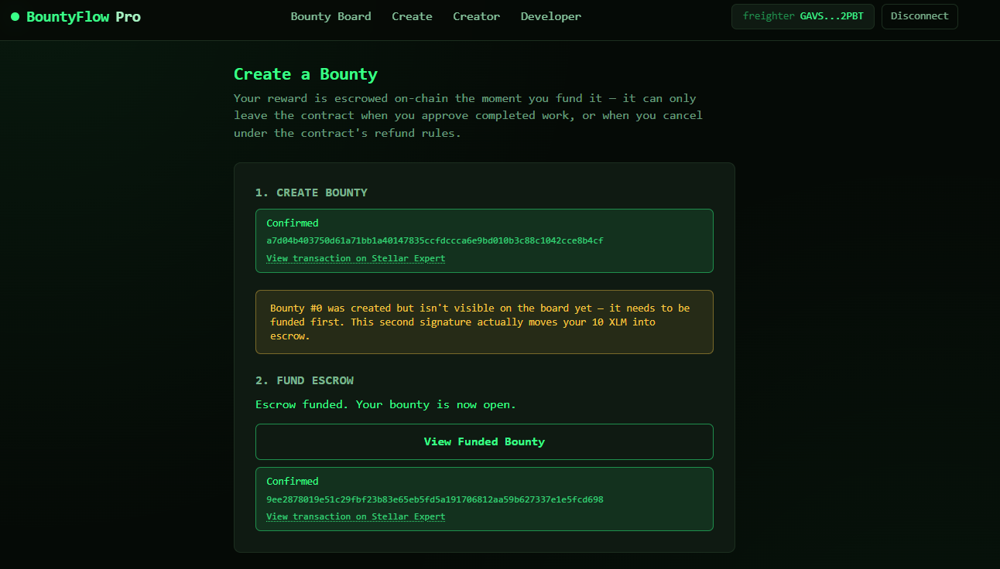
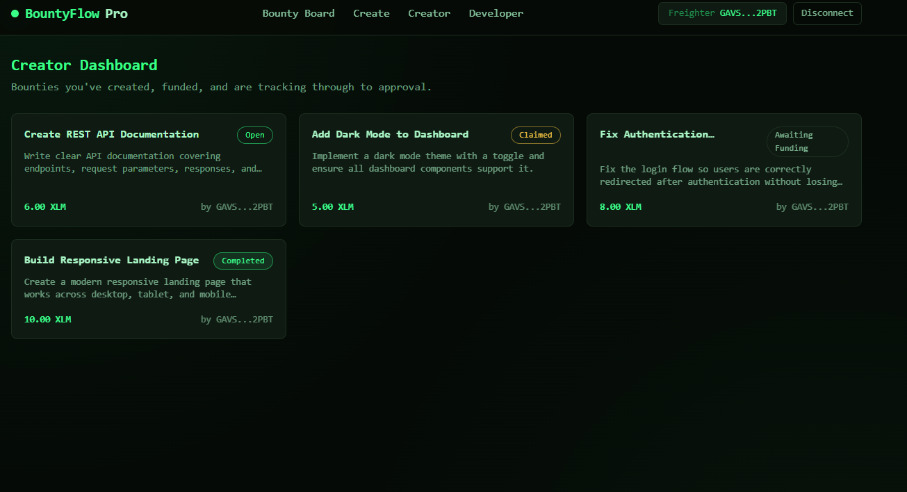
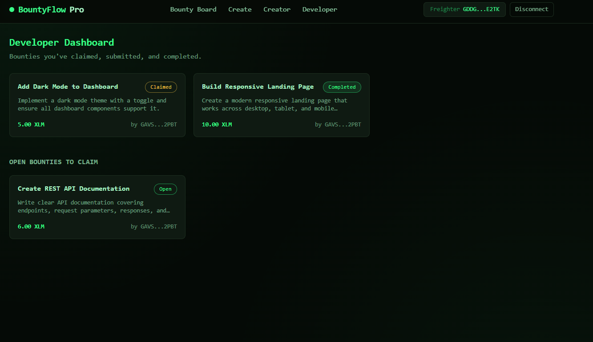
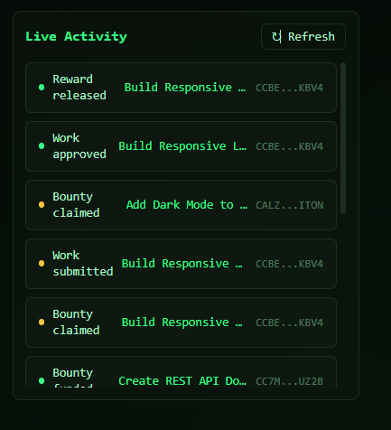
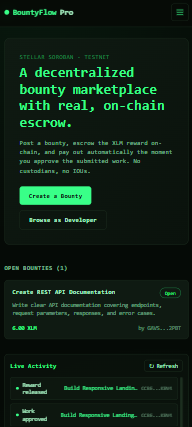
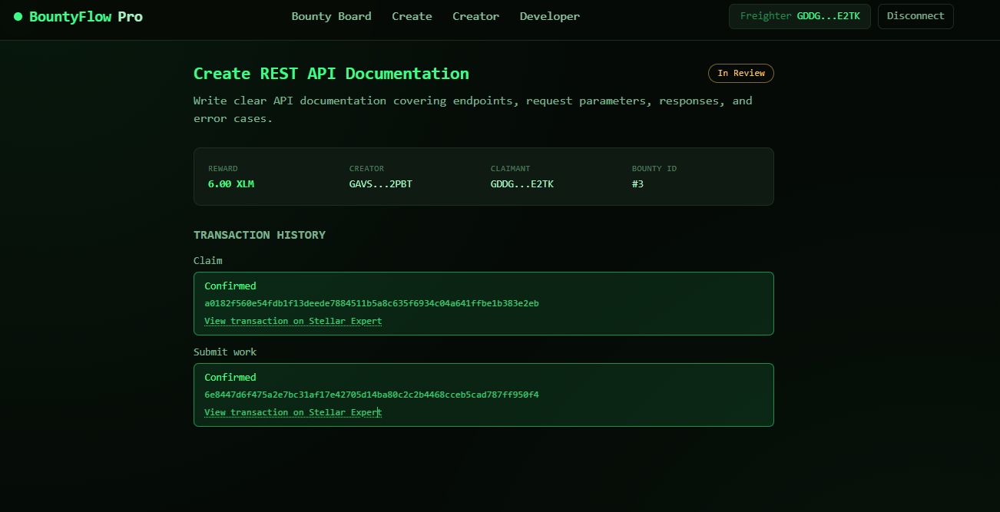
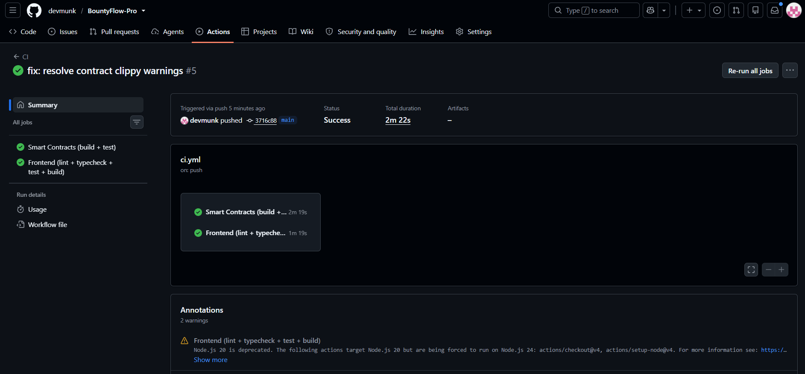
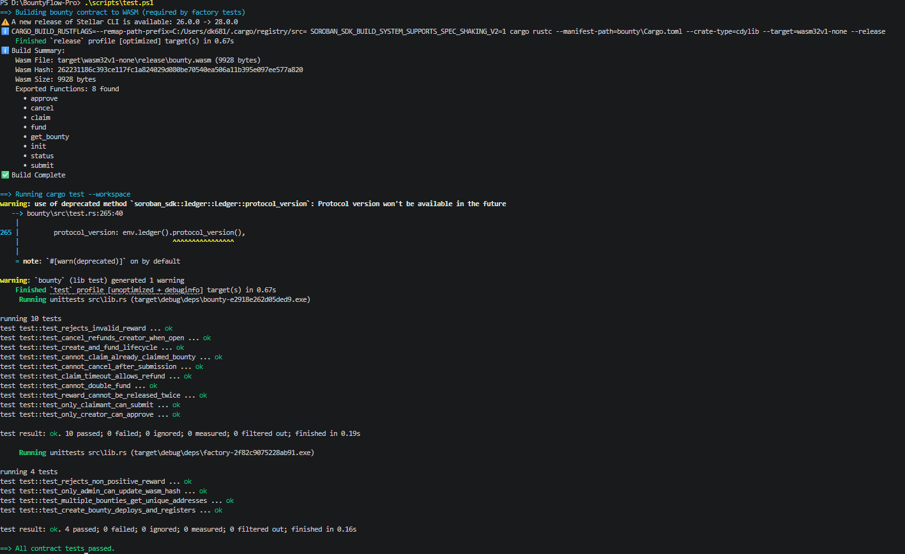

# 🌟 BountyFlow Pro

> 🚀 A decentralized bounty marketplace built on **Stellar Soroban**, with real XLM escrow, on-chain bounty state, wallet integration, and automated smart-contract workflows.

BountyFlow Pro is the **Level 3 evolution of BountyFlow**. It uses Soroban contracts and the Stellar Asset Contract (SAC) for real XLM movement on Stellar Testnet.

---

## 🌐 Live Demo

🔗 **[Launch BountyFlow Pro](https://bounty-flow-pro.vercel.app/)**

🎥 **[Watch the Demo Video](https://youtu.be/l8Ww8Yey8JE?si=3icb8RNDa9lZFAW-)**

> 💡 Connect your Stellar wallet and experience the complete bounty lifecycle:
> **Create → Fund → Claim → Submit → Approve → Release**

---

## 📑 Contents

- [What BountyFlow Pro Does](#-what-bountyflow-pro-does)
- [Screenshots](#-screenshots)
- [Deployed Contracts](#-deployed-contracts)
- [Features](#-features)
- [Architecture](#architecture)
- [Smart Contracts](#-smart-contracts)
- [Escrow and Payment Flow](#-escrow-and-payment-flow)
- [Events and Live Activity](#-events-and-live-activity)
- [Wallet and Transaction Architecture](#-wallet-and-transaction-architecture)
- [Technology Stack](#technology-stack)
- [Repository Structure](#-repository-structure)
- [Setup and Deployment](#-setup-and-deployment)
- [Testing and CI/CD](#-testing-and-cicd)
- [Security](#-security)
- [Level 3 Scope](#-level-3-scope)

---

## 🎯 What BountyFlow Pro Does

BountyFlow Pro connects two roles.

### 👤 Creator

A creator can:

1. 🔗 Connect a supported Stellar wallet.
2. 📝 Create a bounty with a title, description, XLM reward, and claim timeout.
3. 🏭 Deploy a dedicated bounty contract through the factory.
4. 💰 Fund the bounty's escrow with real XLM.
5. 📋 Review submitted work.
6. ✅ Approve completed work.
7. 💸 Release the escrowed reward to the developer.
8. ↩️ Cancel or refund a bounty when permitted by the contract rules.

### 👨‍💻 Developer

A developer can:

1. 🔗 Connect a supported Stellar wallet.
2. 🔎 Browse available bounties.
3. 🎯 Claim an open bounty.
4. 📤 Submit completed work with a description and optional link.
5. 📊 Track the bounty's on-chain state.
6. 💰 Receive the escrowed reward after creator approval.

> 🔐 **Non-custodial:** BountyFlow Pro does not use a backend to hold rewards. Each bounty contract owns and controls its escrowed XLM according to the on-chain contract rules.

---

## 📸 Screenshots

### Bounty Board



### Create Bounty



### Bounty Detail



### Creator Dashboard



### Developer Dashboard



### Live Activity



### Mobile Responsive UI



### Transaction Lifecycle



### CI/CD Pipeline



### Test Output



---

## 📜 Deployed Contracts

All contracts below are deployed on **Stellar Testnet**:

```text
Factory:         CCPJGZQIR2WFJRBU5MCWLM4QIGGXWL7D3UMMWYIQ4FL7QDLKRJOXCDMB
Bounty:          CC7MOHS5SFN3SM3F6YP5QOGBDNFGNPSX33ZIHMSPLIML3MGRSTQFUZ2B
Native XLM SAC:  CDLZFC3SYJYDZT7K67VZ75HPJVIEUVNIXF47ZG2FB2RMQQVU2HHGCYSC
```

### 🔗 Sample Transaction

A successful on-chain contract interaction on **Stellar Testnet**:

```text
Transaction hash:
17de72a756e66a0354402320b0936bafec0c957fdc9c040fbe7facda6ccf42ea
```
Explorer:
https://stellar.expert/explorer/testnet/tx/17de72a756e66a0354402320b0936bafec0c957fdc9c040fbe7facda6ccf42ea

---

## ✨ Features

### 🏪 Marketplace

- 📋 Open bounty board
- 🔎 Individual bounty detail pages
- 👤 Creator dashboard
- 👨‍💻 Developer dashboard
- 📱 Responsive dark interface
- 🔄 Loading, empty, error, and transaction states

### 👤 Creator Workflow

- 🔗 Wallet connection
- 📝 Bounty creation
- 🏭 On-chain bounty deployment
- 💰 XLM escrow funding
- 📋 Submission review
- ✅ Approval and automatic reward release
- ↩️ Refund/cancellation when allowed

### 👨‍💻 Developer Workflow

- 🔎 Browse open bounties
- 🎯 Claim bounties
- 📤 Submit completed work
- 📊 View current bounty status
- 💰 Receive payment after approval

### 👛 Supported Wallets

The frontend uses Stellar Wallets Kit with:

- 🦊 Freighter
- 🐂 xBull
- 🔐 Albedo

Wallet state is shared through `WalletProvider` and `useWallet`. The selected wallet ID is remembered locally so the application can attempt a reconnect when appropriate.

Wallet and transaction cancellation errors are normalized into user-facing messages.

### ⚡ Live Activity

The Live Activity feed is backed directly by **Soroban RPC events**, providing a near-real-time view of bounty activity.

It tracks:

- 🆕 Bounty creation
- 💰 Funding
- 🎯 Claim
- 📤 Work submission
- ✅ Approval
- 💸 Reward release
- ↩️ Refund
- 🔄 Automatic polling
- 🧹 Event de-duplication
- 🔃 Manual refresh
- 📊 Re-fetching of affected bounty data

> 🧠 **State synchronization:** Events are used as change signals, while direct contract reads remain authoritative for the current bounty state.

---
<a name="architecture"></a>
## 🏗️ Architecture

BountyFlow Pro intentionally has no application backend or database.

```text
                    ┌─────────────────────────────┐
                    │      Next.js Frontend       │
                    │                             │
                    │ Pages / Components          │
                    │ WalletProvider / useWallet  │
                    │ useBounties                 │
                    │ useBountyEvents             │
                    │ useTransaction              │
                    └──────────────┬──────────────┘
                                   │
                         Wallet signing / RPC
                                   │
                    ┌──────────────▼──────────────┐
                    │     Stellar Soroban RPC     │
                    └──────────────┬──────────────┘
                                   │
                    ┌──────────────▼──────────────┐
                    │       Factory Contract      │
                    │                             │
                    │ bounty ID → contract        │
                    │ creator → bounty IDs        │
                    │ stored bounty WASM hash     │
                    └──────────────┬──────────────┘
                                   │
                              deploy + init
                                   │
                    ┌──────────────▼──────────────┐
                    │      Bounty Contract #N     │
                    │                             │
                    │ creator / claimant / reward │
                    │ state / submission / token │
                    │ timeout                     │
                    │                             │
                    │ owns escrowed XLM           │
                    └──────────────┬──────────────┘
                                   │
                              token.transfer
                                   │
                    ┌──────────────▼──────────────┐
                    │    Stellar Asset Contract  │
                    │          Native XLM         │
                    └─────────────────────────────┘
```

The blockchain is the source of truth:

- The factory stores bounty registration data.
- Each bounty contract stores its own state.
- Each bounty contract holds its own escrow.
- Soroban RPC provides contract reads, transaction submission/confirmation, and event access.

---

## 📜 Smart Contracts

### 🏭 Factory Contract

`contracts/factory/`

- 🧬 Stores the bounty WASM hash and native XLM SAC address.
- 🚀 Deploys and initializes a new bounty contract for every bounty.
- 🗂️ Maintains the mapping of bounty IDs to contract addresses.
- 👤 Maintains creator-to-bounty ID mappings.
- 🔄 Can update the WASM hash used for **future** bounties.

### 💼 Bounty Contract

`contracts/bounty/`

- 1️⃣ One independent contract instance per bounty.
- 🗃️ Stores the creator, claimant, reward, metadata, submission, timeout, state, and token.
- 💰 Its own contract address holds the escrowed XLM.
- 🔐 Enforces authorization and valid state transitions on-chain.

> 🧩 **Contract isolation:** Each bounty has its own contract instance and escrow, while the Factory coordinates deployment and registration. This demonstrates Soroban inter-contract communication and keeps bounty funds isolated from other bounties.

---

## 💰 Escrow and Payment Flow

### 📝 Creation and Funding

```text
Creator
   │
   │ create_bounty()
   ▼
Factory
   │
   ├── deploy bounty contract
   └── initialize bounty
           │
           ▼
        Created
           │
           │ fund()
           ▼
    Native XLM SAC
           │
           │ transfer
           ▼
    Bounty Contract
           │
           ▼
          Open
```

### 🎯 Claim and Submission

```text
Developer
   │
   │ claim()
   ▼
 Claimed
   │
   │ submit(description, link)
   ▼
 Submitted
```

### ✅ Approval and Payout

```text
Creator
   │
   │ approve()
   ▼
Bounty Contract
   │
   ├── state → Released
   └── token.transfer(contract → claimant)
                         │
                         ▼
                  Developer receives XLM
```

### ↩️ Refund

```text
Creator
   │
   │ cancel()
   ▼
Bounty Contract
   │
   ├── state → Refunded
   └── token.transfer(contract → creator)
```

The escrow is therefore a verifiable on-chain balance at the bounty contract address, not a number maintained only by the frontend.

---

## ⚡ Events and Live Activity

Contracts emit typed events for state-changing actions:

```text
BountyCreated
BountyFunded
BountyClaimed
WorkSubmitted
BountyApproved
RewardReleased
BountyRefunded
```

Frontend implementation:

```text
frontend/src/lib/events.ts
frontend/src/hooks/useBountyEvents.ts
frontend/src/components/ActivityFeed.tsx
```

The event subscription:

- 🏭 Watches the Factory contract.
- 📜 Watches relevant bounty contract addresses.
- 🔄 Polls Soroban RPC approximately every 6 seconds.
- 🔍 Starts with a 1000-ledger lookback.
- 📦 Chunks watched contract IDs into groups of at most 5.
- 📥 Requests up to 100 events per poll.
- 🧠 Keeps a bounded in-memory activity feed.
- 🧹 De-duplicates events using ledger:eventId.
- 🛑 Cleans up its polling timer when the React effect is removed.
- 🔃 Allows Manual Refresh to trigger an immediate poll.

Manual Refresh asks the existing subscription to poll immediately.

A newly created bounty can briefly appear as **Unknown bounty** because the event may arrive before the bounty metadata has entered the current page state. Refreshing the activity stream resolves that synchronization gap.

---

## 👛 Wallet and Transaction Architecture

### 🔗 Wallet Integration

Wallet integration is split between:

```text
frontend/src/lib/wallet.ts
frontend/src/components/WalletProvider.tsx
frontend/src/hooks/useWallet.ts
```

The application uses:

- 🦊 Freighter
- 🐂 xBull
- 🔐 Albedo

`WalletProvider` shares the current wallet address, wallet name, connection state, errors, and connect/disconnect actions across the application.

### 🔄 Transactions

Transactions use:

```text
frontend/src/lib/soroban.ts
frontend/src/hooks/useTransaction.ts
```

Lifecycle:

```text
preparing
   ↓
simulating
   ↓
awaiting-wallet
   ↓
submitted
   ↓
confirming
   ↓
success
```

Any failure enters:

```text
error
```

A submitted hash is not treated as success. The UI waits for confirmed Soroban success.

`useTransaction` also prevents duplicate submissions and keeps wallet-dependent actions using the current connected wallet state.

---
<a name="technology-stack"></a>
## 🛠️ Technology Stack

| Layer                   | Technology                                |
| ----------------------- | ----------------------------------------- |
| 📜 Smart contracts      | Rust + `soroban-sdk`                      |
| ⛓️ Blockchain           | Stellar Soroban Testnet                   |
| 💰 Reward asset         | Native XLM through Stellar Asset Contract |
| 🖥️ Frontend            | Next.js 14 App Router                     |
| 📘 Language             | TypeScript                                |
| 🎨 Styling              | Tailwind CSS                              |
| 👛 Wallet integration   | `@creit.tech/stellar-wallets-kit`         |
| 🔗 Stellar client       | `@stellar/stellar-sdk`                    |
| 🧪 Frontend tests       | Vitest + Testing Library                  |
| 🧪 Contract tests       | Rust / Cargo tests                        |
| ⚙️ CI/CD                | GitHub Actions                            |
| 🪟 Deployment scripting | PowerShell                                |
| 🚫 Backend/database     | None                                      |


---

## 📁 Repository Structure

```text
BountyFlow-Pro/
│
├── contracts/
│   ├── factory/
│   │   └── src/
│   │       ├── lib.rs
│   │       └── test.rs
│   └── bounty/
│       └── src/
│           ├── lib.rs
│           └── test.rs
│
├── scripts/
│   ├── build.ps1
│   ├── test.ps1
│   ├── deploy.ps1
│   ├── configure-frontend.ps1
│   └── deploy-all.ps1
│
├── frontend/
│   ├── src/
│   │   ├── app/
│   │   ├── components/
│   │   ├── hooks/
│   │   ├── lib/
│   │   └── types/
│   ├── tests/
│   └── package.json
│
├── deployments/
├── docs/
│   └── screenshots/
├── .github/
│   └── workflows/
│       ├── ci.yml
│       └── deploy-contracts.yml
├── .env.example
└── README.md
```

---

## 🚀 Setup and Deployment

### 📋 Prerequisites

- Node.js 20+
- Rust
- `wasm32v1-none`
- Stellar CLI
- A supported Stellar wallet

The project uses PowerShell commands and is Windows-first.

Install the required Rust WASM target:

```powershell
rustup target add wasm32v1-none
```

### 🖥️ Frontend

```powershell
cd frontend
npm install
npm run dev
```

Validation:

```powershell
npm run typecheck
npm run build
```

### 🔐 Environment Variables

The frontend uses:

```text
NEXT_PUBLIC_STELLAR_NETWORK
NEXT_PUBLIC_SOROBAN_RPC_URL
NEXT_PUBLIC_NETWORK_PASSPHRASE
NEXT_PUBLIC_FACTORY_CONTRACT_ID
NEXT_PUBLIC_TOKEN_CONTRACT_ID
NEXT_PUBLIC_DEFAULT_CLAIM_TIMEOUT_SECS
```

`DEPLOYER_SECRET_KEY` is deployment-only and must never be a `NEXT_PUBLIC_*` variable.

### 🚀 Contract Deployment

```powershell
./scripts/deploy-all.ps1 -IdentityName bountyflow-deployer -Network testnet
```

Or:

```powershell
./scripts/build.ps1
./scripts/test.ps1
./scripts/deploy.ps1 -IdentityName bountyflow-deployer -Network testnet
./scripts/configure-frontend.ps1 -Network testnet
```

Deployment writes contract information to `deployments/latest.json`.

When bounty WASM is upgraded, existing bounty instances keep their current implementation; the factory's new WASM hash applies to future bounties.

### 🌐 Frontend Deployment

Deploy `frontend/` using the standard Next.js/Vercel configuration and provide the required public environment variables.

---

## 🧪 Testing and CI/CD

### Contracts

```powershell
./scripts/test.ps1
```

Contract tests cover deployment, authorization, claiming, submission, approval/release, refunds, timeout handling, invalid transitions, duplicate payout protection, and reward validation.

### Frontend

```powershell
cd frontend
npm run test
npm run typecheck
npm run build
```

Frontend tests cover validation, error handling, UI rendering, transaction lifecycle, and duplicate submission protection.

### ⚙️ CI/CD

GitHub Actions automatically validates the project on pushes and pull requests to main.

The CI pipeline includes:

- 🦀 Smart contract build
- 🧪 Smart contract tests
- 🎨 Rust formatting checks
- 🔍 Clippy linting
- 📦 Frontend dependency installation
- 🧹 Frontend linting
- 🔎 Type checking
- 🧪 Frontend tests
- 🏗️ Production build

✅ CI Evidence


🧪 Test Evidence


---

## 🔐 Security

- 🔒 Authorization is enforced on-chain. Frontend role checks are used only for UX.
- 💰 Escrow is isolated. Each bounty contract owns its own XLM balance.
- 🚫 No generic withdrawal function is provided.
- 🔄 State changes occur before transfers on payout and refund paths.
- 💵 Rewards are validated on-chain to be positive.
- 🔑 Secrets are not committed or exposed through public environment variables.
- 🛡️ Wallet and contract errors are sanitized before reaching the UI.

---

## 🏆 Level 3 Scope

BountyFlow Pro demonstrates:

- 📜 Advanced Soroban smart contracts
- 🔗 Inter-contract communication
- 💰 Real XLM escrow
- 🔄 On-chain state machines
- ⚡ Typed blockchain events
- 📡 Event polling and live activity updates
- 👛 Shared wallet state
- 🔄 Transaction lifecycle handling
- ⚠️ Error and loading states
- 🧪 Contract and frontend tests
- ⚙️ CI/CD
- 🚀 Scripted smart-contract deployment
- 🌐 Production Next.js frontend
- 📱 Responsive interface
- 🏗️ Production-oriented project structure

---

## 📄 License

This project is currently provided without a separate open-source license.